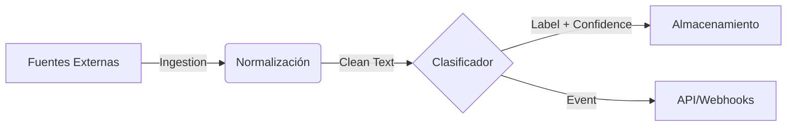

# Skema

**Pipeline de Inteligencia para Clasificación de Requerimientos**

> Skema automatiza el triaje, categorización y enrutamiento de requerimientos de software a escala, transformando entradas de texto no estructurado en datos operativos accionables.

---

## 🎯 El Problema

En equipos de producto y operaciones de ingeniería de alto volumen, la entrada de requerimientos (tickets, feedback de usuarios, historias de usuario) es caótica y ruidosa.

- **Cuello de botella manual:** Product Managers y Tech Leads pierden horas semanales clasificando y asignando tickets.
- **Inconsistencia:** La clasificación manual varía según quién la haga y cuándo.
- **Datos muertos:** El feedback valioso se pierde en el ruido por falta de etiquetado inmediato.

## 💡 La Solución

Skema no es simplemente un script de clasificación; es un **sistema de procesamiento de flujo de datos** diseñado para operar como middleware inteligente entre las fuentes de entrada (Jira, Slack, Email) y los sistemas de gestión.

### Principios de Diseño

1.  **Modularidad Aislada:** La lógica de ingesta, limpieza, inferencia y persistencia están desacopladas. Cambiar el modelo de ML no afecta a la API.
2.  **Product-Ready:** Construido pensando en observabilidad, contratos de datos estrictos y operación continua, no en notebooks experimentales.
3.  **Agnóstico al Modelo:** Arquitectura preparada para intercambiar motores de clasificación (desde RegEx y Heurísticas hasta LLMs) sin reescribir el sistema.

---

## 🏗 Arquitectura de Alto Nivel

El sistema sigue un pipeline lineal desacoplado:



1.  **Ingestion Layer**: Adaptadores para diferentes fuentes de datos.
2.  **Preprocessing Engine**: Limpieza estandarizada para garantizar consistencia en la inferencia.
3.  **Inference Core**: El "cerebro" intercambiable. Actualmente soporta reglas deterministas, extensible a modelos probabilísticos.
4.  **Distribution Layer**: API y persistencia para entregar los resultados donde se necesitan.

---

## 🚀 Casos de Uso Reales

- **Backlog Grooming Automático**: Etiquetar automáticamente tickets entrantes como "Bug", "Feature", "Deuda Técnica" antes de que un humano los vea.
- **Routing de Soporte N1**: Detectar keywords críticas (ej. "login fallido", "seguridad") para escalar incidentes inmediatamente.
- **Análisis de Sentimiento de Producto**: Agregar miles de comentarios de feedback para detectar tendencias en módulos específicos (ej. "Muchos reclamos sobre Reportes").

---

## 🛠 Guía de Inicio Rápido (Local)

Skema está diseñado para levantarse rápidamente en entornos de desarrollo.

### Prerrequisitos

- Python 3.9+
- Pip

### Instalación

```bash
git clone https://github.com/medalcode/Skema.git
cd Skema
pip install -r requirements.txt
python setup.py develop
```

### Ejecución de Servicios

El sistema es modular. Puedes levantar la API para inferencia en tiempo real:

```bash
# Levantar el servidor de API (FastAPI)
python -m skema.api.main
# Endpoint disponible en: http://localhost:8000/classify
```

O ejecutar simulaciones de los subsistemas:

```bash
python -m skema.classifier.main    # Simula entrada de datos
```

---

## 🗺 Roadmap

La evolución de Skema se centra en la integración y la inteligencia:

- [x] **Fase 1: Robustez (Actual)** - Implementación de contratos estrictos de datos y arquitectura hexagonal.
- [ ] **Fase 2: Conectores Reales** - Adaptadores para Jira API y GitHub Issues.
- [ ] **Fase 3: LLM Integration** - Adaptador de inferencia utilizando modelos OpenAI/LocalLLM para clasificación semántica compleja.
- [ ] **Fase 4: Feedback Loop** - Re-entrenamiento automático basado en correcciones humanas.

---

**Estado del Proyecto**: Hito 1 Completado. Arquitectura Hexagonal Estable.
Consulta `BITACORA.md` para el registro operacional diario.
